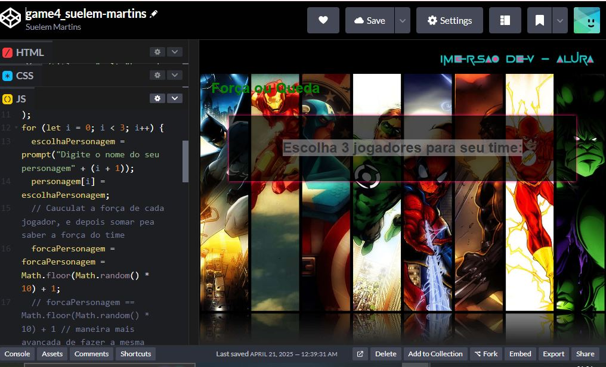

# game4_suelem-martins

A Pen created on CodePen.

Original URL: [https://codepen.io/SuelemMartins/pen/XJWQRdx](https://codepen.io/SuelemMartins/pen/XJWQRdx).

# Jogo: Jogador vs Vilão 🦸‍♂️⚔️

**Descrição**:  
Neste jogo, o objetivo é escolher o seu herói e enfrentá-lo contra um vilão temível. Com uma série de habilidades especiais, o jogador deve usar suas forças e inteligência para derrotar o inimigo e conquistar a vitória! 💥

🎮 **Escolha o seu personagem**, 👹 **enfrente o vilão** e prove que você é o herói da história!



## Como jogar 🚀:
1. **Escolha o seu jogador**: Selecione o herói que você mais se identifica!
2. **Enfrente o vilão**: Uma batalha épica onde o vilão tenta derrotar você.
3. **Use poderes especiais**: Cada jogador possui habilidades únicas que podem ser usadas para ganhar vantagem durante o combate.
4. **Derrote o vilão**: Acabe com o vilão para ganhar o jogo e salvar o dia!

## Tecnologias utilizadas 💻:
- **JavaScript** 🖥️
- **HTML** 🌐
- **CSS** 🎨

## Funcionalidades 🛠️:
- **Batalha entre herói e vilão**: Um confronto onde cada escolha do jogador faz a diferença.
- **Poderes especiais**: Habilidades únicas para garantir a vitória!
- **Interface interativa**: Design responsivo e dinâmico para melhorar a experiência do jogador.

## Como rodar o jogo 🏁:
1. Clone o repositório:
   ```bash
   git clone https://github.com/SuelemMartins/imersao-alura-aula4-jogador-vs-vilao.git


